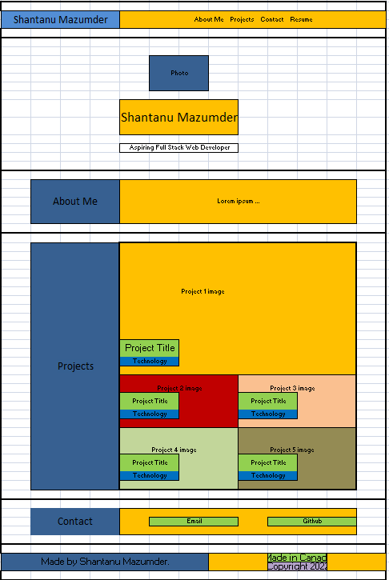

# Shantanu Mazumder - Portfolio Site

## Description
The purpose of this site is to show case the technical skills and the knowledge of Shantanu Mazumder as a Full Stack Web Developer. The site includes a brief bio about him, as well as links to some of his notable projects, their deployed links and their corresponding Github repositories. This will allow for a potential employer to view and evaluate his quality of work for themselves.

## Wireframe diagram
The following image shows the wireframe diagram for the html:

## Deployed Site
The refactored site can be accessed by clicking [here](https://shawnmaz.github.io/portfolio/).

---
© 2022 Shantanu Mazumder.